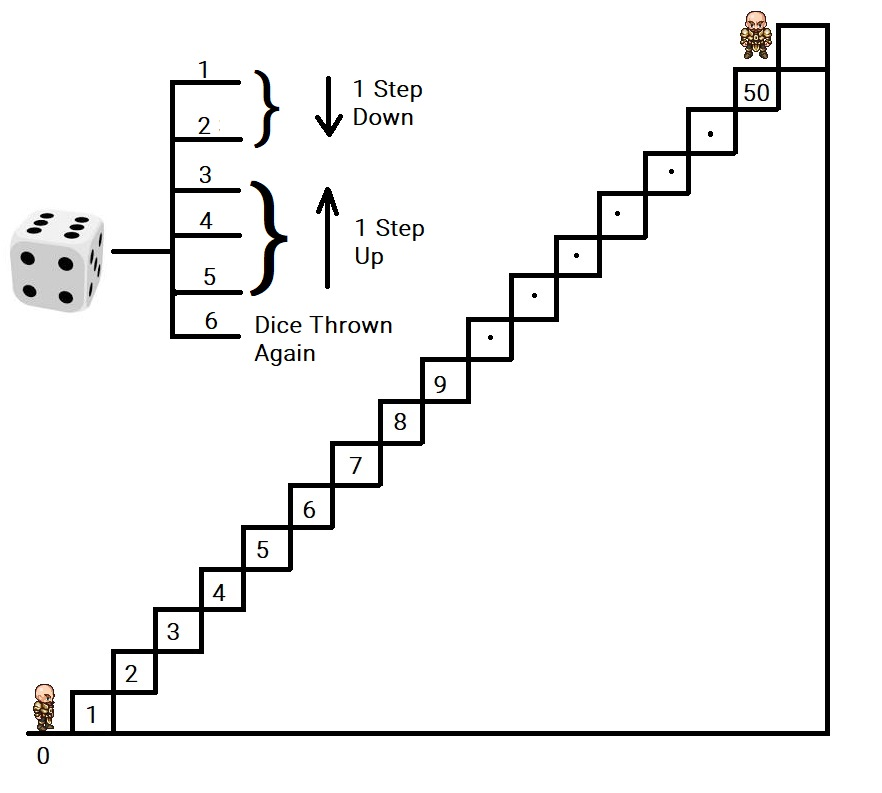

# RandomWalk-DataCamp

### About Site:
- A python Intermediate Course at datacamp
- Creation of RandomWalk algorithm in its tutorial

### About Programme:
> A man is wanting to go upstairs.
> But he does it in such a way:
> He is initially is on the 0th stair,
> he throws a die, if it shows up 1 or 2, 
> he move 1 steps **downward**.
> If the die shows 3, 4, or 5, he moves 1 step **upwards**.
> And if the die shows 6, then he throws it again and 
> move up the number of steps equal to the number shown 
> on the dice in this throw

The program is to find the probability if he reaches the 50th Floor in 100 dice throws.

